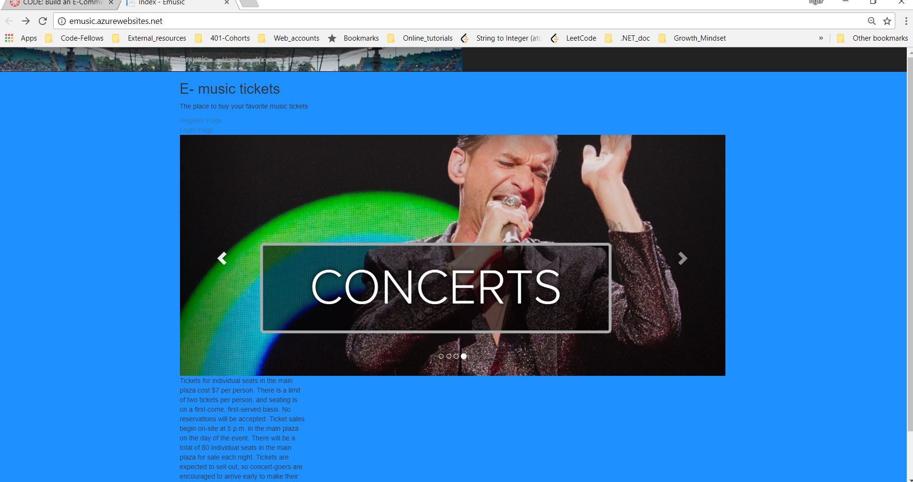
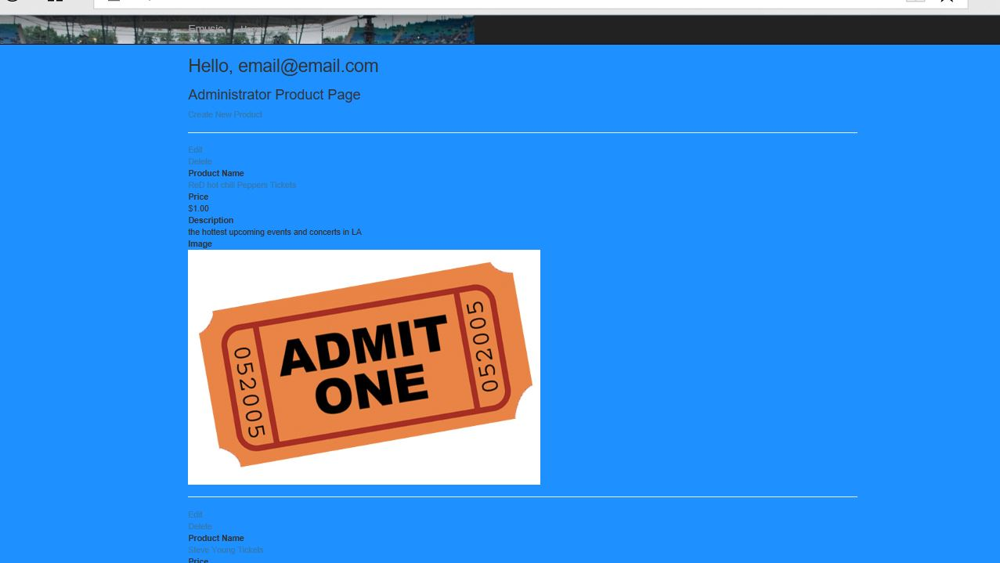

## Emusic-Commerce Store
This is a web based application that mimics basic principles of a real ecommerce store website. In
my lab I have choosen to sell music tickets of various degress. This e-commerce store also has
Identity attached; which means there is part functionality based around it.

Deployed Version
_unavialable 

## Author:
Tiger Hsu

## Version:
1.0.0

## Overview
This is a music ticket store; we sell music tickets.

# Product:
Music tickets for around a dollar. There are several types ranging from $1 to $2 dollars.

# Polices:
Polices allows members to access certain areas of the website; In my instance if you are a Administator you 
are allowed to view, edit, and delete different types of tickets.

# Claims: 
Claims work similar to Polices; only certain users are allowed to access a certain part of the website.
In my attempt; If a user selects ILoveListeningON Headphones; then only the user is allowed to purchase 
an online album. Another claim is if the user only likes country music they are only allowed to listen to Garth Brooks.

# OAUTH
-INCOMPLETE

# Eamil:
-INCOMPLETE

# Code Coverage:
-INCOMPLETE

## Getting Started
1. Clone the repository to your local machine.
2. Select into application directory where the *AppName.sln* exist.
3. Open the application using *Open/Start AppName.sln*.
5. The website will run on your default web browser routing to the main home page.

## Example
The Front of the Store

Admin Page

<!-- Show them what looks like and how how to use the application.  -->

## Architecture
 - C# ASP.NET Core application.
 - MVC architectural design pattern.
 - Entity Framework - built in Visual Studio

## Attribution
Josh Taylor

## Resources
StackoverFlow
Microsoft Docs

## License
MIT License

## Change Log

05-09-2018 12:16pm - First Attempt
